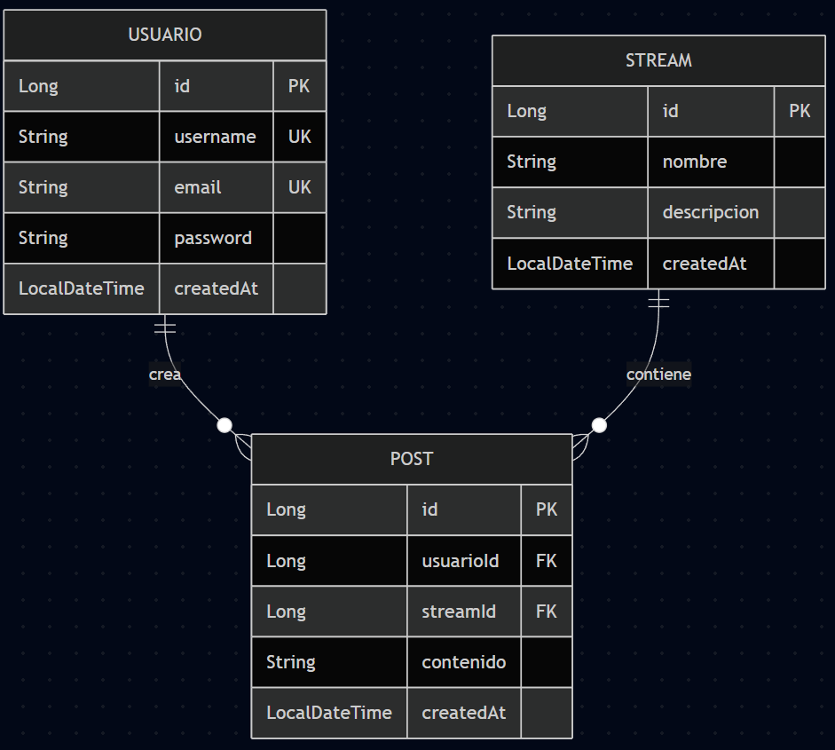
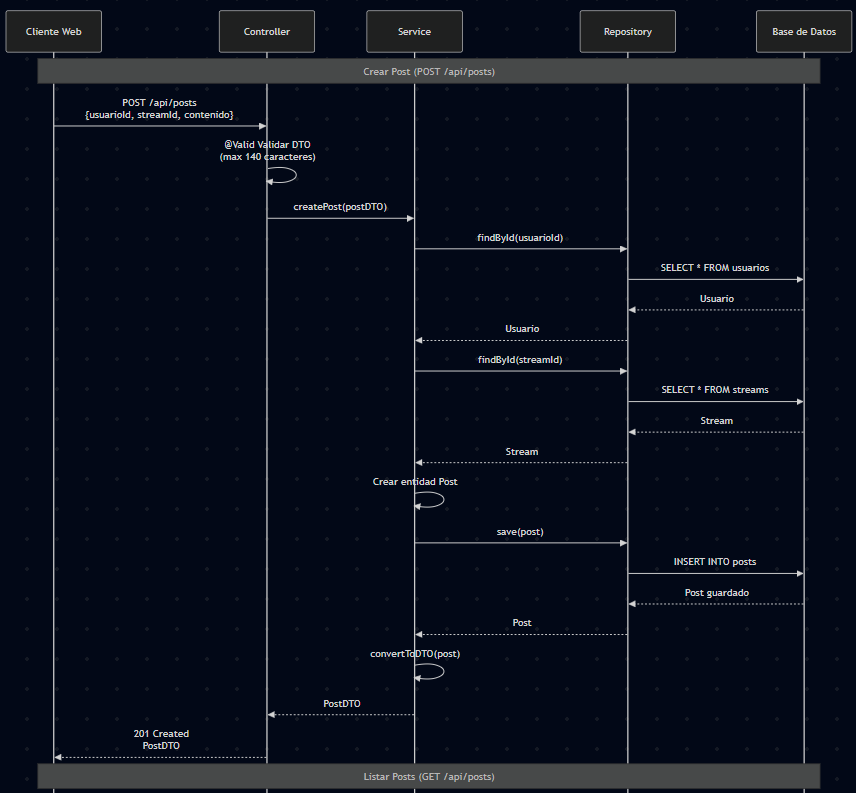
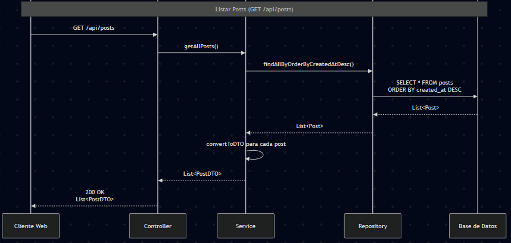

# AREP-Lab07-Microservicios

Tarea de Microservicios

# Autores

- Juan Esteban Medina Rivas
- María Paula Sánchez Macías
- Sergio Andrés Bejarano Rodríguez

# Twitter Clone API - Monolito Spring Boot

API REST monolítico tipo Twitter que permite crear posts de 140 caracteres y registrarlos en streams (hilos).

## 📋 Características

- ✅ CRUD completo de Users
- ✅ CRUD completo de Streams (hilos)
- ✅ CRUD completo de Posts
- ✅ Validación de 140 caracteres máximo por post
- ✅ Relaciones entre entidades (User → Posts, Stream → Posts)
- ✅ Ordenamiento de posts por fecha (más recientes primero)
- ✅ Base de datos H2 en memoria (desarrollo)
- ✅ Manejo de excepciones global
- ✅ CORS configurado

## 🛠️ Tecnologías

- Java 17
- Spring Boot 3.2.0
- Spring Data JPA
- Spring Validation
- H2 Database (desarrollo)
- MySQL (producción)
- Lombok
- Maven

## 📁 Estructura del Proyecto

```
twitter-clone-api/
├── src/
│   ├── main/
│   │   ├── java/com/twitter/api/
│   │   │   ├── TwitterApiApplication.java
│   │   │   ├── config/
│   │   │   │   └── CorsConfig.java
│   │   │   ├── controller/
│   │   │   │   ├── UserController.java
│   │   │   │   ├── StreamController.java
│   │   │   │   └── PostController.java
│   │   │   ├── dto/
│   │   │   │   ├── UserDTO.java
│   │   │   │   ├── StreamDTO.java
│   │   │   │   └── PostDTO.java
│   │   │   ├── entity/
│   │   │   │   ├── User.java
│   │   │   │   ├── Stream.java
│   │   │   │   └── Post.java
│   │   │   ├── repository/
│   │   │   │   ├── UserRepository.java
│   │   │   │   ├── StreamRepository.java
│   │   │   │   └── PostRepository.java
│   │   │   ├── service/
│   │   │   │   ├── UserService.java
│   │   │   │   ├── StreamService.java
│   │   │   │   └── PostService.java
│   │   │   └── exception/
│   │   │       ├── GlobalExceptionHandler.java
│   │   │       └── ResourceNotFoundException.java
│   │   └── resources/
│   │       ├── application.properties
│   │       └── data.sql
│   └── test/
├── pom.xml
└── run.sh
```

## 🚀 Instalación y Ejecución

### Prerequisitos

- Java 17 o superior
- Maven 3.6 o superior

### Opción 1: Script de ejecución (Linux/Mac)

```bash
chmod +x run.sh
./run.sh
```

### Opción 2: Comandos Maven

```bash
# Compilar
mvn clean install

# Ejecutar
mvn spring-boot:run
```

### Opción 3: JAR ejecutable

```bash
mvn clean package
java -jar target/twitter-clone-api-1.0.0.jar
```

La aplicación estará disponible en: `http://localhost:8080`

## 🗄️ Base de Datos

### H2 Console (Desarrollo)

- URL: http://localhost:8080/h2-console
- JDBC URL: `jdbc:h2:mem:twitterdb`
- Username: `sa`
- Password: (vacío)

### MySQL (Producción)

Para usar MySQL, consulta el archivo `CONFIGURACION-MYSQL.md`

**Quick Start MySQL:**

```bash
# 1. Crear base de datos
mysql -u root -p -e "CREATE DATABASE twitterdb;"

# 2. Ejecutar con perfil MySQL
mvn spring-boot:run -Dspring-boot.run.profiles=mysql
```

Configuración en `application-mysql.properties`

## 📡 Endpoints del API

### Usuarios

| Método | Endpoint          | Descripción               |
| ------ | ----------------- | ------------------------- |
| GET    | `/api/users`      | Listar todos los usuarios |
| GET    | `/api/users/{id}` | Obtener usuario por ID    |
| POST   | `/api/users`      | Crear nuevo usuario       |
| PUT    | `/api/users/{id}` | Actualizar usuario        |
| DELETE | `/api/users/{id}` | Eliminar usuario          |

**Ejemplo POST /api/users:**

```json
{
  "username": "juanperez",
  "email": "juan@example.com",
  "password": "password123"
}
```

### Streams

| Método | Endpoint                  | Descripción                |
| ------ | ------------------------- | -------------------------- |
| GET    | `/api/streams`            | Listar todos los streams   |
| GET    | `/api/streams/{id}`       | Obtener stream por ID      |
| POST   | `/api/streams`            | Crear nuevo stream         |
| GET    | `/api/streams/{id}/posts` | Obtener posts de un stream |

**Ejemplo POST /api/streams:**

```json
{
  "nombre": "General",
  "descripcion": "Stream principal de posts"
}
```

### Posts

| Método | Endpoint                   | Descripción                 |
| ------ | -------------------------- | --------------------------- |
| GET    | `/api/posts`               | Listar todos los posts      |
| GET    | `/api/posts/{id}`          | Obtener post por ID         |
| POST   | `/api/posts`               | Crear nuevo post            |
| DELETE | `/api/posts/{id}`          | Eliminar post               |
| GET    | `/api/posts/user/{userId}` | Obtener posts de un usuario |

**Ejemplo POST /api/posts:**

```json
{
  "userId": 1,
  "streamId": 1,
  "contenido": "Este es mi primer post! 🚀"
}
```

**Nota:** El contenido del post tiene un máximo de 140 caracteres.

## 🧪 Pruebas con cURL

### Crear usuario

```bash
curl -X POST http://localhost:8080/api/users \
  -H "Content-Type: application/json" \
  -d '{
    "username": "juanperez",
    "email": "juan@example.com",
    "password": "password123"
  }'
```

### Crear stream

```bash
curl -X POST http://localhost:8080/api/streams \
  -H "Content-Type: application/json" \
  -d '{
    "nombre": "General",
    "descripcion": "Stream principal"
  }'
```

### Crear post

```bash
curl -X POST http://localhost:8080/api/posts \
  -H "Content-Type: application/json" \
  -d '{
    "userId": 1,
    "streamId": 1,
    "contenido": "Mi primer post en el sistema!"
  }'
```

### Listar todos los posts

```bash
curl http://localhost:8080/api/posts
```

### Obtener posts de un stream específico

```bash
curl http://localhost:8080/api/streams/1/posts
```

### Obtener posts de un usuario específico

```bash
curl http://localhost:8080/api/posts/user/1
```

## 🎯 Modelo de Datos

### Entidades

**User**

- id (Long, PK)
- username (String, único)
- email (String, único)
- password (String)
- createdAt (LocalDateTime)
- posts (List<Post>, relación 1:N)

**Stream**

- id (Long, PK)
- nombre (String)
- descripcion (String)
- createdAt (LocalDateTime)
- posts (List<Post>, relación 1:N)

**Post**

- id (Long, PK)
- userId (Long, FK)
- streamId (Long, FK)
- contenido (String, max 140 caracteres)
- createdAt (LocalDateTime)

### Relaciones

- Un Usuario puede crear muchos Posts (1:N)
- Un Stream contiene muchos Posts (1:N)
- Un Post pertenece a un Usuario y a un Stream (N:1)

## ✅ Validaciones

- Username: 3-50 caracteres, único
- Email: formato válido, único
- Password: mínimo 6 caracteres
- Contenido del post: 1-140 caracteres
- IDs: requeridos para crear posts

## 🔒 Manejo de Errores

El API maneja los siguientes errores:

- **404 Not Found:** Recurso no encontrado
- **400 Bad Request:** Validación fallida o datos inválidos
- **500 Internal Server Error:** Error del servidor

**Ejemplo de respuesta de error:**

```json
{
  "timestamp": "2025-10-26T10:30:00",
  "status": 404,
  "message": "Usuario no encontrado con id: 5"
}
```

## 📊 Datos de Prueba

El proyecto incluye datos de prueba en `data.sql`:

- 3 usuarios
- 3 streams
- 5 posts

Se cargan automáticamente al iniciar la aplicación.

## 🔍 Verificación del Sistema

Checklist de verificación:

- [ ] Servidor inicia en puerto 8080
- [ ] H2 Console accesible
- [ ] Crear usuario mediante POST
- [ ] Crear stream mediante POST
- [ ] Crear post de 140 caracteres
- [ ] Validación rechaza posts > 140 caracteres
- [ ] Posts listados por fecha descendente
- [ ] Relaciones entre entidades funcionan
- [ ] CORS configurado correctamente

## 🎨 Arquitectura

### Capas

1. **Controller:** Maneja peticiones HTTP y respuestas
2. **Service:** Contiene lógica de negocio
3. **Repository:** Acceso a datos (JPA)
4. **Entity:** Modelo de dominio
5. **DTO:** Transferencia de datos

### Patrón de Diseño

- Arquitectura en capas (Layered Architecture)
- Repository Pattern
- DTO Pattern
- Dependency Injection

### Diagramas

- **Diagrama de clases**



- **Diagrama de secuencia para creación de post**



- **Diagrama de secuencia para obtención de posts de un stream**



## Despliegue en S3

Se crea el bucket donde se almacenarán los archivos estáticos:


Y para cada archivo se habilita el acceso público para que esté disponible en internet.


Resultado:


## Seguridad con JWT

Se configuró la aplicación para delegar la autenticación a AWS Cognito. En el backend se añadió Spring Security como cliente OAuth2 confidencial (authorization code flow), se ajustaron sesiones/cookies y se actualizaron controladores para usar el principal autenticado. En el frontend se redirige siempre al login de Cognito para que se consuma el API usando las cookies de sesión. En AWS Cognito se creó el User Pool y el app client con secret, habilitando el Hosted UI y registrando las URLs de callback/sign-out del backend.

Desde Amazon Cognito se crea el grupo:


Luego, el cliente de aplicación:


Se realiza la configuración de páginas de inicio de sesión:


Se crean los usuarios:


Importante conocer dominio de cognito:


Clse de configuración de seguridad:

```java
@Configuration
@EnableWebSecurity
public class SecurityConfig {

    @Bean
    public CorsConfigurationSource corsConfigurationSource() {
        CorsConfiguration config = new CorsConfiguration();
        config.setAllowedOrigins(List.of(
                "http://localhost:8080",
                "https://arep-mini-twitter.s3.us-east-1.amazonaws.com/index.html"));

        config.setAllowedMethods(List.of("GET", "POST", "PUT", "DELETE", "OPTIONS"));
        config.setAllowedHeaders(List.of("*"));
        config.setExposedHeaders(List.of("Location"));
        config.setAllowCredentials(true);
        UrlBasedCorsConfigurationSource source = new UrlBasedCorsConfigurationSource();
        source.registerCorsConfiguration("/**", config);
        return source;
    }

    @Bean
    public SecurityFilterChain securityFilterChain(HttpSecurity http) throws Exception {
        http
                .csrf(csrf -> csrf.disable())
                .cors(cors -> cors.configurationSource(corsConfigurationSource()))
                .authorizeHttpRequests(auth -> auth
                        .requestMatchers("/", "/index.html", "/css/**", "/js/**", "/favicon.ico").permitAll()
                        .requestMatchers("/h2-console/**").permitAll()
                        .requestMatchers("/login/**", "/oauth2/**", "/logout").permitAll()
                        .requestMatchers("/api/auth/**").permitAll()
                        .requestMatchers(HttpMethod.GET, "/api/posts/**", "/api/streams/**", "/api/users/**")
                        .permitAll()
                        .requestMatchers(HttpMethod.POST, "/api/users").permitAll()
                        .requestMatchers(HttpMethod.OPTIONS, "/**").permitAll()
                        .anyRequest().authenticated())
                .oauth2Login(oauth2 -> oauth2
                        .loginPage("/oauth2/authorization/cognito")
                        .defaultSuccessUrl("/index.html", true)
                        .failureUrl("/index.html?error=login_failed")
                        .permitAll())
                .logout(logout -> logout
                        .logoutUrl("/logout")
                        .logoutSuccessUrl("/oauth2/authorization/cognito")
                        .invalidateHttpSession(true)
                        .deleteCookies("JSESSIONID"));

        http.headers(headers -> headers.frameOptions(frame -> frame.sameOrigin()));

        return http.build();
    }
}
```

Resultado:

https://github.com/user-attachments/assets/b21cc29b-79c5-4286-81ba-6522b68706aa

## 📝 Logs

Los logs están configurados en nivel DEBUG para desarrollo. Verás:

- Queries SQL ejecutadas
- Peticiones HTTP recibidas
- Respuestas enviadas

## 🤝 Contribución

Este proyecto es parte de un taller académico.

## 📄 Licencia

Proyecto educativo - Uso académico

---

**Fecha:** Octubre 2025
**Versión:** 1.0.0
